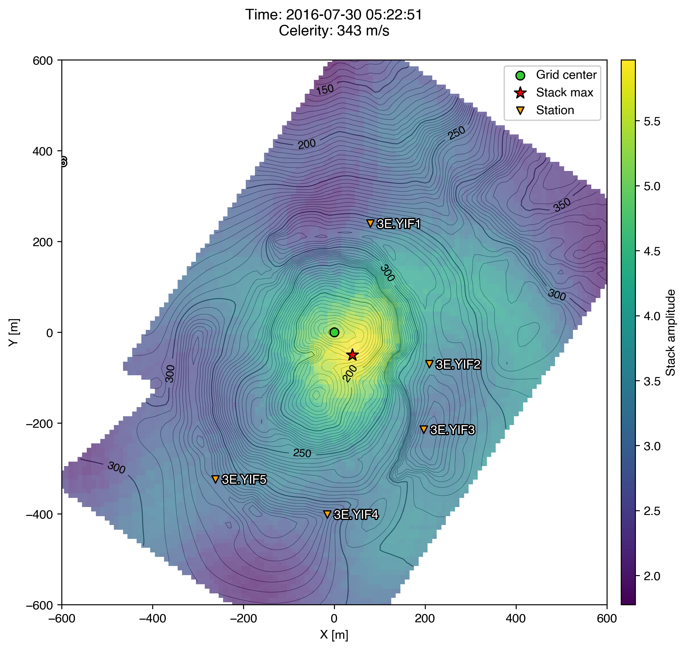

rtm
===

[](https://uaf-rtm.readthedocs.io/en/master/)
[](https://mybinder.org/v2/gh/uafgeotools/rtm/HEAD)

_rtm_ is a Python package for locating infrasound sources using reverse time
migration (RTM). Infrasound (or seismic) waveform data are back-projected over
a grid of trial source locations. This implementation and some examples are
detailed in Fee et al. (2021), and we ask that if you use this code you cite
that paper. The code is based upon previous work by Sanderson et al. (2020) and
Walker et al. (2010) and is applicable to a wide variety of network geometries
and sizes. Realistic travel times can be incorporated from path length difference
or full-waveform numerical modeling over topography.



**References**

Fee, D., Toney, L., Kim, K., Sanderson, R. W., Iezzi, A. M., Matoza, R. S.,
De Angelis, S., Jolly, A. D., Lyons, J. J., & Haney, M. M. (2021). Local
Explosion Detection and Infrasound Localization by Reverse Time Migration Using
3-D Finite-Difference Wave Propagation. _Frontiers in Earth Science_, 9.
[https://doi.org/10.3389/feart.2021.620813](https://doi.org/10.3389/feart.2021.620813)

Sanderson, R. W., Matoza, R. S., Fee, D., Haney, M. M., & Lyons, J. J. (2020).
Remote detection and location of explosive volcanism in Alaska with the
EarthScope Transportable Array. _Journal of Geophysical Research: Solid Earth_,
125, e2019JB018347.
[https://doi.org/10.1029/2019JB018347](https://doi.org/10.1029/2019JB018347)

Walker, K. T., Hedlin, M. A. H., de Groot‐Hedlin, C., Vergoz, J., Le Pichon,
A., & Drob, D. P. (2010). Source location of the 19 February 2008 Oregon bolide
using seismic networks and infrasound arrays. _Journal of Geophysical Research:
Solid Earth_, 115, B12329.
[https://doi.org/10.1029/2010JB007863](https://doi.org/10.1029/2010JB007863)

Installation
------------

We recommend you install this package into a new
[conda](https://docs.conda.io/projects/conda/en/latest/index.html) environment.
(Please install [Anaconda](https://www.anaconda.com/products/individual) or
[Miniconda](https://docs.conda.io/en/latest/miniconda.html) before proceeding.)
The environment must contain all of the packages listed in the
[Dependencies](#dependencies) section. For ease of installation, we've provided
an
[`environment.yml`](https://github.com/uafgeotools/rtm/blob/master/environment.yml)
file which specifies all of these dependencies as well as instructions for
installing _rtm_ itself. To install _rtm_ in this manner, execute the following
commands:
```
git clone https://github.com/uafgeotools/rtm.git
cd rtm
conda env create
```
This creates a new conda environment named `rtm` and installs _rtm_ and all of
its dependencies there.

The final command above installs _rtm_ in "editable" mode, which means that you
can update it with a simple `git pull` in your local repository. We recommend
you do this often, since this code is still under rapid development.

Dependencies
------------

_uafgeotools_ repositories:

* [_waveform_collection_](https://github.com/uafgeotools/waveform_collection)

Python packages:

* [cartopy](https://scitools.org.uk/cartopy/docs/latest/)
* [ObsPy](https://docs.obspy.org/)
* [rioxarray](https://corteva.github.io/rioxarray/stable/)

...and their dependencies, which you don't really have to be concerned about if
you're using conda!

Optional dependencies:

* [PyGMT](https://www.pygmt.org/latest/) (install via `conda install --channel 
  conda-forge pygmt`) — For automatic DEM downloading
* [*infresnel*](https://infresnel.readthedocs.io/en/latest/) (install via `pip install
  git+https://github.com/liamtoney/infresnel.git`) — For path length difference modeling

Usage
-----

Documentation is available online
[here](https://uaf-rtm.readthedocs.io/en/master/).

To use _rtm_, you must always first activate the `rtm` environment with:
```
conda activate rtm
```
Then, you may access the package's functions from the Python interpreter with
(for example)
```python
from waveform_collection import gather_waveforms
from rtm import define_grid
```
and so on. For usage examples, see the two notebooks
[`example_local.ipynb`](https://github.com/uafgeotools/rtm/blob/master/example_local.ipynb)
and
[`example_regional.ipynb`](https://github.com/uafgeotools/rtm/blob/master/example_regional.ipynb).

Authors
-------

(_Alphabetical order by last name._)

David Fee<br>
Liam Toney
